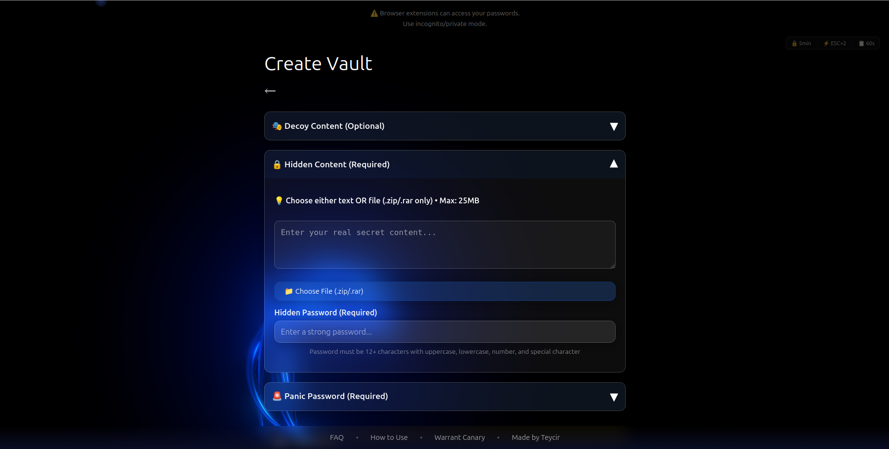
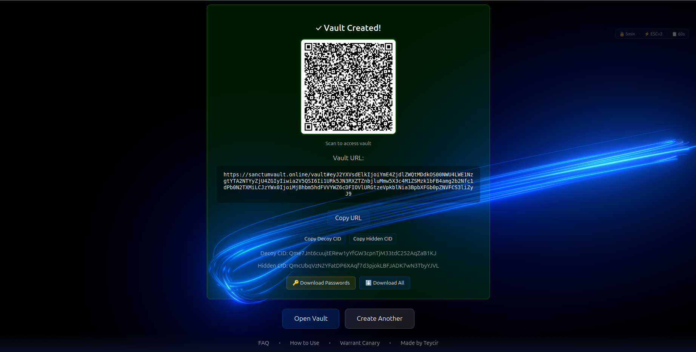
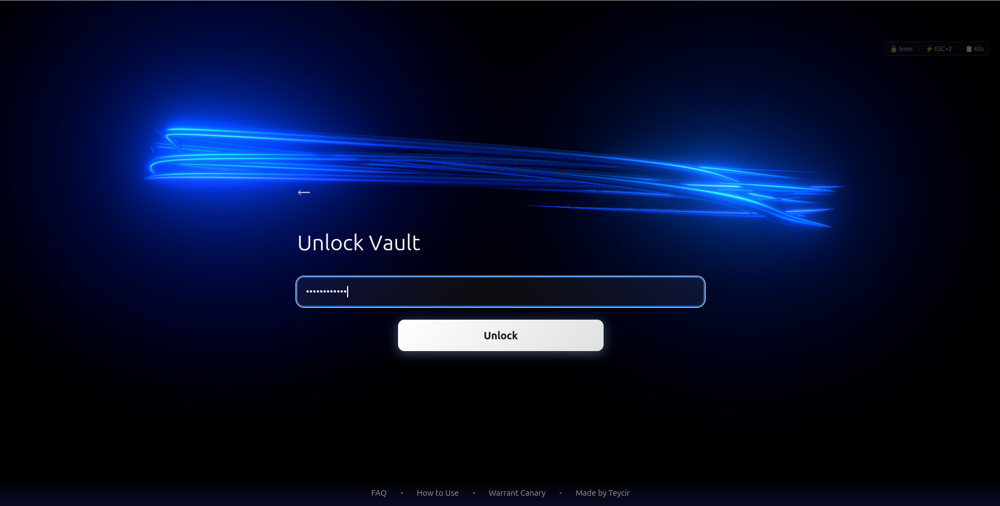
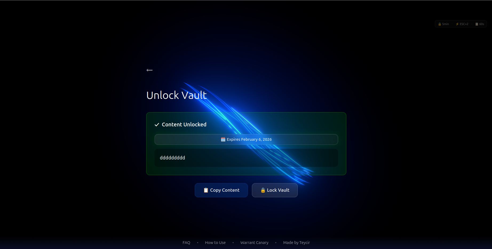

<div align="center">


<a href="https://sanctumvault.online">
  
</a>

**Zero-trust encrypted vault system for high-risk users.**

### _"Duress proof.."_

[📺 Watch Demo](https://youtu.be/k54qKVYhcrM) · [Create a Vault](#-quick-start) · [View Architecture](#️-architecture) · [Report Bug](https://github.com/teycir/Sanctum/issues)

</div>

---

## 📑 Table of Contents

- [Overview](#-overview)
- [Warrant Canary](#-warrant-canary)
- [Quick Start](#-quick-start)
- [Operating Modes](#-operating-modes)
- [Architecture](#️-architecture)
- [Security Attack Scenarios](#️-security-attack-scenarios)
- [OpSec Guidelines](#-opsec-guidelines)
- [Storage Providers](#-storage-providers)
- [FAQ](#-faq)
- [Project Status](#-project-status)
- [Contributing](#-contributing)
- [License](#-license)

---

## ⚡ Overview

**Sanctum** is a zero-trust, client-side encrypted vault system designed for activists, journalists, whistleblowers, and anyone facing physical duress, device seizure, or censorship. It provides **cryptographically sound plausible deniability** through passphrase-derived hidden layers while leveraging decentralized IPFS storage.

### Screenshots

<div align="center">

#### Landing Page


#### Create Vault


#### Vault Created


#### Unlock Vault


#### Unlocked Content


</div>

### Why is this different?

> Most "secure storage" apps rely on "trust me bro" promises. Sanctum is **Cryptographically Deniable** with **Decentralized Storage**.

### Real-World Use Cases

**🗞️ Journalist Protecting Sources**
- Decoy: Published articles and public research notes
- Hidden: Confidential source documents and whistleblower communications
- Scenario: Device seized at border crossing - reveal decoy, sources stay protected

**✊ Activist in Authoritarian Regime**
- Decoy: Personal photos and innocuous social media content
- Hidden: Protest coordination plans and evidence of government abuse
- Scenario: Police raid - show decoy layer, cannot prove hidden content exists

**💰 Crypto Holder Under Duress**
- Decoy: Small wallet with $200 ("this is all I have")
- Hidden: Main wallet with life savings
- Scenario: $5 wrench attack - hand over decoy wallet, real funds stay safe

**🔔 Whistleblower Securing Evidence**
- Decoy: Work documents and meeting notes
- Hidden: Evidence of corporate fraud or government corruption
- Scenario: Employer demands access - show work files, evidence remains hidden

**🏠 Domestic Abuse Survivor**
- Decoy: Shared family photos and household documents
- Hidden: Escape plan, evidence of abuse, emergency contacts
- Scenario: Abuser demands access - show family content, safety plan protected

**🕵️ Intelligence Operative**
- Decoy: Tourist photos and travel itinerary
- Hidden: Mission briefings, contact networks, classified intelligence
- Scenario: Captured by hostile forces - reveal tourist cover, mission data stays secure

**🌍 Human Rights Defender**
- Decoy: Public advocacy materials and educational content
- Hidden: Witness testimonies and documentation of atrocities
- Scenario: Interrogation - reveal public work, witnesses stay anonymous

### Key Features

- 🎭 **Plausible Deniability** - Hidden layers indistinguishable from decoy content
- 🚨 **Panic Passphrase** - Shows "vault deleted" under duress (3rd layer)
- ⏰ **30-Day Grace Period** - Accidentally expired vaults can be recovered
- 🌐 **Decentralized Storage** - Data pinned on IPFS via free services (Pinata/Filebase)
- 🔑 **XChaCha20-Poly1305** - Military-grade encryption with split-key architecture
- 🚫 **Zero Server Trust** - All crypto operations in browser, keys never touch server
- 🧠 **RAM-Only Storage** - No disk persistence, immune to forensic recovery
- 💰 **100% Free** - No credit card required, stack multiple free tiers
- 🔒 **Auto-Lock** - Locks after 5 minutes of inactivity
- ⚡ **Panic Key** - Double-press Escape for instant lockout
- 📋 **Secure Clipboard** - Auto-clears after 60 seconds
- 📦 **File Support** - Upload .zip/.rar archives up to 25MB

---

## 🐦 Warrant Canary

**[View Live Canary](https://sanctumvault.online/canary)** - Auto-updates with current timestamp on every visit


**Statement:**

As of the date above, Sanctum developers have:

✅ **NOT received any:**
- National Security Letters (NSLs)
- FISA court orders
- Gag orders preventing disclosure of legal demands
- Requests to implement backdoors or weaken encryption
- Requests to log user activity or decrypt user data
- Warrants requiring disclosure of user information

✅ **NOT been:**
- Compelled to modify source code
- Required to hand over cryptographic keys (none exist server-side)
- Forced to compromise the integrity of the system

✅ **Architecture guarantees:**
- Zero-knowledge: We cannot decrypt user vaults (client-side encryption)
- No user logs: We don't collect IP addresses, usage patterns, or metadata
- No backdoors: All code is open-source and auditable
- RAM-only: No persistent storage of keys or credentials

**Verification:**
- This canary is updated quarterly
- Signed commits verify authenticity
- If this section is removed or not updated for >90 days, assume compromise
- Check commit history: `git log --show-signature README.md`

**What We CAN Be Compelled To Do:**
- Take down the hosted service (users can self-host)
- Remove specific vault IDs from our database (data remains on IPFS)
- Provide encrypted vault metadata (useless without KeyA in URL)

**What We CANNOT Be Compelled To Do:**
- Decrypt user vaults (cryptographically impossible)
- Provide user passphrases (never transmitted to server)
- Log future user activity (architecture prevents it)

**If This Canary Dies:**
1. Assume legal compromise
2. Self-host immediately: `npm run dev`
3. Use Tor Browser for all vault access
4. Rotate all passphrases
5. Migrate to new IPFS providers

---

## 🚀 Quick Start

### For Users

1. Visit [sanctumvault.online](https://sanctumvault.online)
2. Configure Pinata or Filebase (free IPFS providers)
3. Create your vault with optional decoy content
4. Set passphrase for hidden layer
5. Share the link - only you know the passphrase

### For Developers

```bash
# Clone repository
git clone https://github.com/Teycir/Sanctum.git
cd Sanctum

# Install dependencies
npm install

# Login to Cloudflare (for deployment)
npx wrangler login

# Run development server
npm run dev
```

## 📚 Documentation

- [Project Status](./docs/PROJECT-STATUS.md) - Current implementation status
- [Security Features](./docs/SECURITY-FEATURES.md) - Auto-lock, panic key, secure clipboard
- [RAM-Only Storage](./docs/security/RAM-ONLY-STORAGE.md) - Forensic-resistant architecture
- [Timing Attack Mitigation](./docs/security/TIMING-ATTACK-MITIGATION.md) - Defense against timing attacks
- [Security Audit](./docs/SECURITY-AUDIT.md) - Security analysis and recommendations

## 🔒 Operating Modes

### 1️⃣ Simple Secure Vault

**Use Case:** Secure backup of sensitive data without duress concerns.

Basic encrypted storage without deniability. Single encrypted blob uploaded to IPFS.

---

### 2️⃣ Duress Hidden (Current Implementation)

**Use Case:** $5 wrench attacks, device seizures, coercion scenarios.

**How it works:**

**Client-Side (Browser):**
1. User creates vault with decoy + hidden content
2. Browser encrypts both layers with XChaCha20-Poly1305
3. Uploads encrypted blobs to IPFS (Pinata/Filebase)
4. Generates split keys: KeyA (stays in URL) + KeyB (sent to server)
5. Server encrypts KeyB and stores with encrypted IPFS CIDs

**Server-Side (Cloudflare D1):**
- Stores: Encrypted KeyB, Encrypted CIDs, vault metadata
- **Two-stage cleanup** prevents database overflow:
  - **Stage 1**: Expired vaults marked inactive (`is_active = 0`) - soft delete
  - **Stage 2**: Vaults inactive for 30+ days permanently deleted
- **30-day grace period**: Accidentally expired vaults can be recovered

**Unlock Flow:**
1. User enters passphrase
2. Browser fetches encrypted metadata from server
3. Combines KeyA (from URL) + KeyB (from server) to decrypt IPFS CIDs
4. Downloads encrypted blobs from IPFS
5. Decrypts with passphrase → reveals decoy or hidden layer

**Passphrase Behavior:**
- **Empty/Decoy passphrase** → Shows decoy layer (innocent content)
- **Hidden passphrase** → Shows hidden layer (real secrets)
- **Panic passphrase** → Shows "vault deleted" error (duress protection)
- **Wrong passphrase** → Error: "Invalid passphrase"

**Error Messages (Plausible Deniability):**
All unavailable scenarios show identical message: `"Vault content has been deleted from storage providers"`
- Panic passphrase entered
- Vault expired (soft deleted)
- Vault doesn't exist
- IPFS blobs missing

**3-Layer Protection:**
1. **Decoy Layer** - Innocent content (optional)
2. **Hidden Layer** - Real secrets (required)
3. **Panic Layer** - Shows "vault erased" (cryptographically indistinguishable from real deletion)

---

## 🏗️ Architecture

### Technology Stack

- **Frontend**: Next.js 15 + React + Web Crypto API
- **Hosting**: Cloudflare Pages (static site, free tier)
- **Database**: Cloudflare D1 (split-key storage)
- **Cryptography**: @noble/ciphers + @noble/hashes (XChaCha20-Poly1305, Argon2id)
- **Storage**: IPFS via Pinata/Filebase with public gateway fallback
- **State**: RAM-only (Web Workers, no persistence)
  - Keys never written to disk
  - Auto-wiped on browser close
  - Protected from disk forensics
  - Isolated in Web Worker memory
- **Backend**: Minimal (only split-key storage, no content access)

### Zero-Trust Design

```
┌─────────────────────────────────────┐
│           Browser (Client)          │
│  ┌─────────────────────────────┐   │
│  │   Web Worker (RAM-only)     │   │
│  │   • Argon2id key derivation │   │
│  │   • XChaCha20 encryption    │   │
│  │   • Split-key architecture │   │
│  │   • Auto-clear on idle      │   │
│  └─────────────────────────────┘   │
└──────────────┬──────────────────────┘
               │
               ├──────────► Cloudflare D1
               │            • Encrypted KeyB
               │            • Encrypted CIDs
               │            • Vault metadata
               │
               ├──────────► IPFS (Pinata/Filebase)
               │            • Encrypted blobs
               │            • Public gateways
               │            • Decentralized storage
```

**Critical**: All encryption client-side. Server only stores encrypted fragments.

## 🛡️ Security: Attack Scenarios

### "Can I just reveal the passphrase under torture?"

**✅ YES, BY DESIGN.** Reveal the decoy layer. The adversary:
- Sees funded wallet + innocent files
- **Cannot prove** hidden layers exist
- Cryptographically indistinguishable from simple vault

### "What if they analyze the encrypted blob size?"

**✅ MITIGATED.** Each layer is padded to standard sizes, making size analysis unreliable.

### "Can they brute-force the passphrase?"

**❌ NO.** Argon2id with 256MB memory and 3 iterations makes brute-force computationally infeasible. Use strong passphrases (6+ Diceware words).

### "What if they perform disk forensics on my device?"

**✅ SAFE.** Sanctum uses RAM-only storage with zero disk persistence:
- No localStorage/sessionStorage for sensitive data
- Keys cleared on tab close
- Ephemeral salts regenerated per session
- Immune to disk carving and SSD wear-leveling analysis

See [RAM-ONLY-STORAGE.md](./docs/security/RAM-ONLY-STORAGE.md) for technical details.

### "What if they seize the IPFS providers?"

**✅ SAFE.** Data is encrypted before upload. Providers only see encrypted blobs. Without your passphrase and vault link, decryption is impossible.

### "What if they compromise Cloudflare Workers?"

**⚠️ LIMITED IMPACT.** Attacker gets encrypted metadata only. Cannot get: Passphrases, decrypted content, or KeyA (in URL).

### "What if I lose the vault link?"

**💀 LOST FOREVER.** No recovery mechanism exists (by design). **Save your links securely.**

### "Can I delete a vault after creating it?"

**❌ NO.** IPFS data is immutable. **Workaround:** Don't share the link.

---

### Threat Model Coverage

- ✅ **Physical duress** ($5 wrench attacks, torture)
- ✅ **Device seizure** (law enforcement, border control)
- ✅ **Censorship** (government blocking, deplatforming)


### Security Features

**Cryptographic**:
- **Plausible Deniability** - Hidden layers cryptographically indistinguishable from decoy
- **XChaCha20-Poly1305** - Authenticated encryption with 256-bit keys
- **Argon2id KDF** - 256MB memory, 3 iterations (brute-force resistant)
- **Split-Key Architecture** - KeyA (URL) + KeyB (encrypted in DB)
- **Vault ID Integrity** - 16-byte hash prevents cross-vault contamination

**Access Control**:
- **Auto-Lock** - 5 minutes inactivity timeout
- **Panic Key** - Double-press Escape for instant lockout
- **Rate Limiting** - 5 attempts/min per vault, 50/hour per fingerprint
- **Fingerprint Tracking** - SHA-256(IP + User-Agent) for abuse detection
- **Honeypot Protection** - Auto-ban on suspicious activity

**Privacy & Forensics**:
- **RAM-Only Storage** - Zero disk persistence, immune to forensics
- **History Clearing** - Vault URL auto-removed from browser history
- **Secure Clipboard** - Auto-clears after 60 seconds
- **Provider Isolation** - Pinata/Filebase are separate namespaces

**Attack Mitigation**:
- **Randomized Timing** - 500-2000ms delay prevents timing analysis
- **CSRF Protection** - Origin/referer validation
- **Security Headers** - X-Frame-Options, X-XSS-Protection, nosniff
- **Input Sanitization** - HTML entity encoding on all user input

See [Security Features](./docs/SECURITY-FEATURES.md) and [RAM-Only Storage](./docs/security/RAM-ONLY-STORAGE.md) for details.

## 🔐 OpSec Best Practices

1. **Fund decoy realistically** - $50-500 matching your financial status, include transaction history
2. **Memorize passphrases** - 12+ chars (uppercase, lowercase, number, special). Example: `MySecret#Vault2024`
3. **Use Tor Browser** - Hides IP, defeats timing attacks (100-500ms noise)
4. **Test before trusting** - Verify decoy unlocks, practice plausible deniability script
5. **Never reveal hidden layers** - Act natural, claim "this is all I have"
6. **Store links securely** - Password manager (KeePassXC/Bitwarden), never email/cloud
7. **Anti-keylogger** - Copy/paste from password manager, inspect USB ports


**Duress Response:** Reveal decoy passphrase only. Adversary cannot prove hidden layers exist (cryptographic guarantee).

---

## 🌐 Storage Providers

### Pinata
- **Free Tier**: 1 GB storage, 500 files, 10 GB bandwidth/month
- **Signup**: Email only (no credit card)

### Filebase
- **Free Tier**: 5 GB storage, unlimited bandwidth
- **Signup**: Email only (no credit card)

## ❓ FAQ

### Why do I see 2 files on IPFS even with empty decoy?

**This is a security feature, not a bug.** Duress vaults always upload 2 encrypted blobs:

1. **Decoy blob** - Even if empty, creates cryptographic chaff
2. **Hidden blob** - Your actual secret content

**Security advantages:**
- **Metadata resistance** - Adversary cannot determine which blob is decoy vs hidden
- **Plausible deniability** - You can claim "I forgot the other passphrase" or "It's a backup"
- **Consistent behavior** - All vaults look identical (2 blobs, same size), preventing pattern analysis
- **Future-proofing** - Can add decoy content later without changing structure

Even "empty" encrypted blobs have minimum size (salt + nonce + auth tag + padding), making them indistinguishable from real data. This is exactly how VeraCrypt's hidden volumes work.

**The small IPFS storage cost (~few KB) is worth the security benefit.**

### How do I unlock a vault?

1. Open the vault link
2. Enter passphrase (no passphrase = decoy, correct passphrase = hidden)
3. Download or copy the decrypted content

### What if I lose the vault link?

**💀 LOST FOREVER.** No recovery mechanism exists (by design).

**Best practices:** Save in password manager, print QR code, never share over unencrypted channels

### What are the file size limits?

**Maximum: 25 MB** (per file, .zip or .rar archives supported)

## 📊 Project Status

**Phase**: Production Ready ✅  
**Tests**: 115/115 passing (19 test suites)  
**Coverage**: Core crypto, duress layers, storage, services, vault expiry, security features

See [PROJECT-STATUS.md](./docs/PROJECT-STATUS.md) for details.

## 💼 Contributing

We welcome contributions! Open an issue or submit a pull request on GitHub.

### Areas We Need Help

- 🔐 Security auditing
- 🧪 Testing (unit, integration, e2e)
- 🌍 Internationalization
- 📚 Documentation
- 🎨 UI/UX improvements

## 📜 License

Business Source License 1.1 - see [LICENSE](./LICENSE) for details.

**Summary**: Free for non-production use. Production use requires a commercial license after 4 years from release date.

## 🙏 Acknowledgments

- **TimeSeal** - Parent project providing cryptographic patterns
- **Cloudflare Pages** - Free static site hosting
- **Pinata** - Free IPFS pinning service
- **Filebase** - Free IPFS storage service
- **VeraCrypt** - Inspiration for plausible deniability
- **3D Tubes Cursor Effect** - [soju22's CodePen](https://codepen.io/soju22/pen/qEbdVjK) (CC BY-NC-SA 4.0)

## 🔗 Links

- **Website**: [sanctumvault.online](https://sanctumvault.online)
- **TimeSeal**: [timeseal.online](https://timeseal.online)
- **Ghost Chat**: [ghost-chat.pages.dev](https://ghost-chat.pages.dev)


## 📞 Contact & Support

- **Issues**: [GitHub Issues](https://github.com/Teycir/Sanctum/issues)
- **Contact**: [teycirbensoltane.tn](https://teycirbensoltane.tn)

## ⚖️ Legal & Ethics

### Intended Use Cases

✅ **Legitimate Privacy Needs**:
- Journalists protecting sources
- Activists in authoritarian regimes
- Crypto holders preventing theft
- Whistleblowers securing evidence
- Individuals under threat of violence

❌ **Prohibited Use**:
- Illegal content storage
- Facilitating crimes
- Evading lawful investigations (where no duress exists)

### Disclaimer

Sanctum is a tool for legitimate privacy and security needs. Users are responsible for complying with local laws. The developers do not condone illegal activities.

---

<div align="center">

**Built with ❤️ and 🔒 by [Teycir Ben Soltane](https://teycirbensoltane.tn)**
</div>
